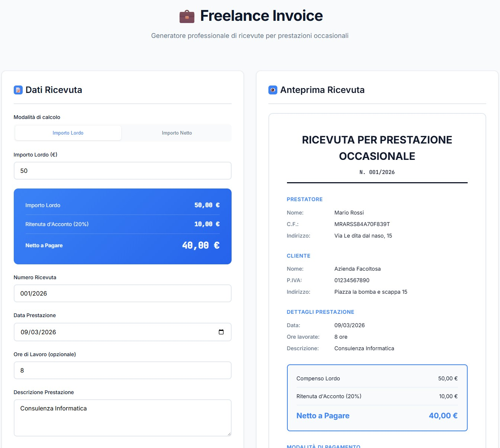

# 💼 Freelance Invoice

**Generatore professionale di ricevute per prestazioni occasionali**

Un tool web completo e gratuito per creare ricevute fiscalmente conformi per prestazioni occasionali in Italia. Calcolo automatico della ritenuta d'acconto, gestione coordinate bancarie e generazione PDF professionale.

[](https://fli.dfix.it)
[](https://opensource.org/licenses/MIT)
[](https://www.paypal.com/paypalme/mailboxporter)

---

## ✨ Caratteristiche

### 💰 Calcolo Automatico Intelligente
- **Toggle Lordo/Netto**: scegli se partire dall'importo lordo o netto
- **Ritenuta d'Acconto al 20%**: calcolo automatico conforme alla normativa italiana
- **Anteprima in tempo reale**: vedi tutti gli importi mentre compili il form

### 📋 Marca da Bollo Automatica
- **Rilevamento automatico**: alert visivo quando l'importo supera €77,47
- **Dicitura legale**: inserimento automatico nel PDF e nell'anteprima
- **Link informativo**: collegamento diretto alla guida dell'Agenzia delle Entrate

### 💳 Metodi di Pagamento Completi
- Bonifico bancario con coordinate complete (IBAN, intestatario, banca)
- Contanti, assegno, PayPal, Stripe/Carta
- **Validazione IBAN**: controllo formato italiano automatico
- **Auto-completamento**: l'intestatario si compila dal nome prestatore

### ⚖️ Conformità Fiscale
Tutte le dichiarazioni legali incluse:
- ✅ Carattere occasionale della prestazione
- ✅ Franchigia €5.000 con riferimenti normativi
- ✅ Esenzione IVA (art. 5 DPR 633/1972)
- ✅ GDPR (Reg. UE 679/2016)
- ✅ Imposta di bollo (quando necessaria)

### 📄 PDF Professionale
- Layout pulito e professionale
- Tutti i dati fiscali richiesti
- Nome file automatico personalizzato
- Generazione completamente client-side (nessun upload di dati)

---

## 🚀 Demo Live

Prova subito il tool: **[fli.dfix.it](https://fli.dfix.it)**

---



---

## 📦 Installazione

### Uso Semplice
1. Scarica la cartella `app`
2. Apri con il browser `index.html`
3. Inizia a creare ricevute!

### Hosting Web
1. Clona questo repository:
```bash
git clone https://github.com/tuousername/freelance-invoice.git
```

2. Carica il contenuto della cartella `app` sul tuo server web

3. Fatto! Non sono richieste dipendenze server-side

---

## 💻 Utilizzo

1. **Scegli la modalità di calcolo**: lordo o netto
2. **Inserisci l'importo**: il tool calcola automaticamente ritenuta e netto/lordo
3. **Compila i dati**:
   - Numero ricevuta e data
   - Descrizione prestazione e ore (opzionale)
   - Dati prestatore (chi emette)
   - Dati cliente (chi riceve)
   - Metodo di pagamento
4. **Controlla l'anteprima** in tempo reale
5. **Genera il PDF** con un click!

---

## 🛠️ Tecnologie

- **HTML5/CSS3**: interfaccia moderna e responsive
- **Vanilla JavaScript**: nessun framework pesante
- **jsPDF**: generazione PDF client-side
- **Google Fonts**: tipografia professionale (Inter, JetBrains Mono)

### Perché senza framework?
- ✅ **Zero dipendenze server**: funziona ovunque, anche offline
- ✅ **Velocissimo**: caricamento istantaneo
- ✅ **Privacy**: tutti i dati restano nel tuo browser
- ✅ **Facile da customizzare**: un singolo file HTML

---

## 🎨 Personalizzazione

### Colori
Modifica le variabili CSS in `:root`:
```css
:root {
    --primary: #0f172a;
    --accent: #3b82f6;
    --success: #10b981;
    /* ... */
}
```

### Logo/Branding
Cerca e modifica le sezioni:
- Header `<h1>💼 Freelance Invoice</h1>`
- Footer con il tuo link

### Numero ricevuta
Il formato predefinito è `001/ANNO`. Modificalo in:
```javascript
document.getElementById('receiptNumber').value = '001/' + new Date().getFullYear();
```

---

## 📋 Requisiti di Sistema

- Browser moderno (Chrome, Firefox, Safari, Edge)
- JavaScript abilitato
- Nessun requisito server-side

---

## 🐛 Segnalazione Bug

Hai trovato un bug? [Apri una issue](https://github.com/donatodelpeschio/fli/issues)

---

## 🤝 Contribuire

I contributi sono benvenuti! 

1. Fai un fork del progetto
2. Crea un branch per la tua feature (`git checkout -b feature/AmazingFeature`)
3. Commit le modifiche (`git commit -m 'Add some AmazingFeature'`)
4. Push al branch (`git push origin feature/AmazingFeature`)
5. Apri una Pull Request

---

## 💝 Supporta il Progetto

Se questo tool ti è stato utile, considera di offrirmi un caffè! ☕

[](https://www.paypal.com/paypalme/mailboxporter)

Il tuo supporto mi aiuta a mantenere e migliorare questo progetto!

---

## ⚠️ Disclaimer

Questo strumento è fornito **a scopo informativo**. 

Le ricevute generate sono conformi alle normative italiane vigenti al momento dello sviluppo, ma è **sempre consigliabile consultare un commercialista** per questioni fiscali specifiche e per verificare la corretta compilazione in base alla propria situazione.

L'autore non si assume responsabilità per l'uso improprio del tool o per eventuali errori nelle ricevute generate.

---

## 📄 Licenza

Questo progetto è rilasciato sotto licenza **MIT**. Vedi il file [LICENSE](LICENSE) per i dettagli.

```
MIT License

Copyright (c) 2026 Donato del Peschio

Permission is hereby granted, free of charge, to any person obtaining a copy
of this software and associated documentation files (the "Software"), to deal
in the Software without restriction, including without limitation the rights
to use, copy, modify, merge, publish, distribute, sublicense, and/or sell
copies of the Software, and to permit persons to whom the Software is
furnished to do so, subject to the following conditions:

The above copyright notice and this permission notice shall be included in all
copies or substantial portions of the Software.

THE SOFTWARE IS PROVIDED "AS IS", WITHOUT WARRANTY OF ANY KIND, EXPRESS OR
IMPLIED, INCLUDING BUT NOT LIMITED TO THE WARRANTIES OF MERCHANTABILITY,
FITNESS FOR A PARTICULAR PURPOSE AND NONINFRINGEMENT. IN NO EVENT SHALL THE
AUTHORS OR COPYRIGHT HOLDERS BE LIABLE FOR ANY CLAIM, DAMAGES OR OTHER
LIABILITY, WHETHER IN AN ACTION OF CONTRACT, TORT OR OTHERWISE, ARISING FROM,
OUT OF OR IN CONNECTION WITH THE SOFTWARE OR THE USE OR OTHER DEALINGS IN THE
SOFTWARE.
```

---

## 🙏 Ringraziamenti

- [jsPDF](https://github.com/parallax/jsPDF) per la generazione PDF
- [Google Fonts](https://fonts.google.com/) per le font
- Tutti i freelance italiani che hanno bisogno di strumenti semplici e gratuiti!

---

## 📞 Contatti

- **Website**: [donatodelpeschio.it](https://donatodelpeschio.it)
- **GitHub**: [@donatodelpeschio](https://github.com/donatodelpeschio)

---

<div align="center">

**Fatto con ❤️ per semplificare la vita dei freelance italiani**

⭐ Se ti piace il progetto, lascia una stella su GitHub!

</div>
